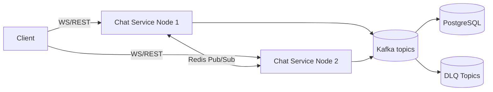
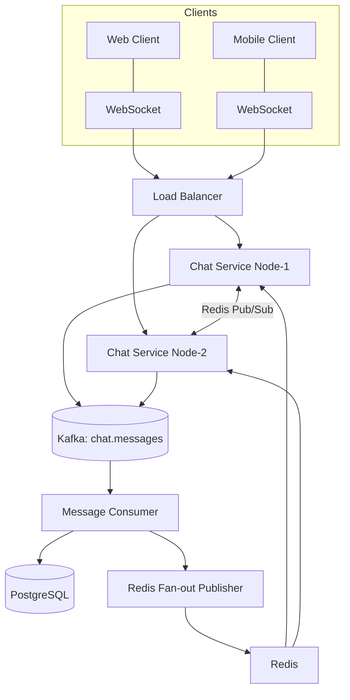
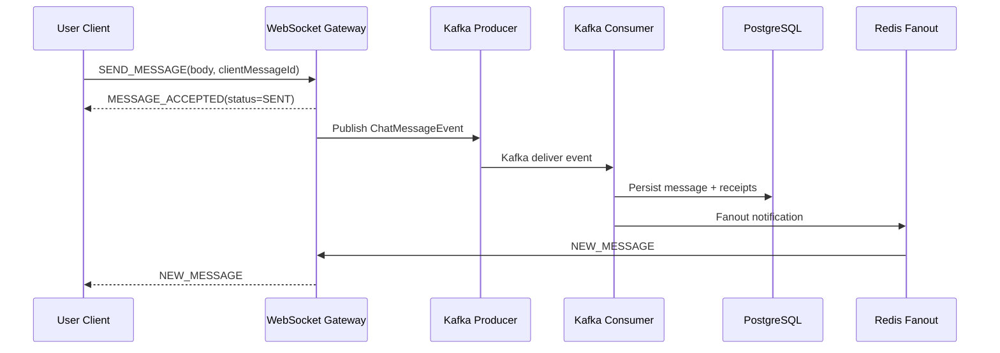
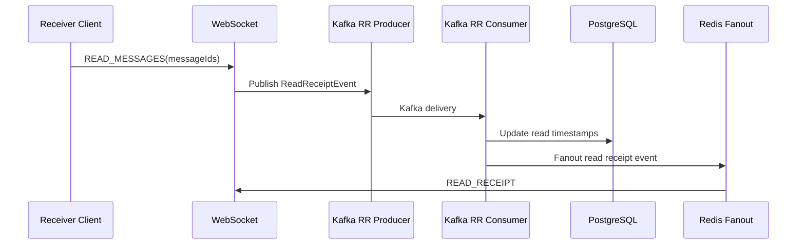

# Real-Time Chat Messaging System

WhatsApp-style real-time messaging, designed with scalable distributed system patterns, event-driven architecture, and observability tooling. The system supports multi-node WebSocket fan-out, Kafka-based persistence pipeline, offline message sync, delivery/read receipts, session replication through Redis, and fault-tolerant processing with DLQ.

---

##  Features
- Real-time messaging over WebSockets
- Distributed fan-out over Redis pub/sub
- Kafka event processing pipeline (`chat.messages`, `chat.read-receipts`, DLQ topics)
- Delivery & read receipts (`SENT → DELIVERED → READ`)
- Offline sync (chat summary + unread messages)
- Idempotent write handling using `clientMessageId`
- DLQ framework for bad event handling & replay
- Observability: Micrometer, Prometheus, Grafana dashboards
- Horizontal scalability + multi-node support

---

## Architecture Overview


---

##  Tech Stack
| Component | Technology                      |
|-----------|---------------------------------|
| Language | Java 17                         |
| Framework | Spring Boot                     |
| Transport | WebSocket + REST                |
| Messaging | Apache Kafka                    |
| Fan-out | Redis Pub/Sub                   |
| Database | PostgreSQL                      |
| Observability | Micrometer, Prometheus, Grafana |
| Packaging | Maven / Docker                  |

---

##  Project Structure
```
backend/
  domain/
  ws/
  messaging/
  service/
  session/
  web/
  repository/
infra/
  docker-compose.yml
  prometheus.yml
```

---

##  API Documentation
### Users
| Method | Endpoint | Description |
|--------|-----------|-------------|
| POST | `/users` | Create user |

### Chats
| Method | Endpoint | Description |
|--------|-----------|-------------|
| POST | `/chats` | Create chat |
| GET | `/chats/summary` | Unread count per chat |

### Messages
| Method | Endpoint |
|--------|----------|
| POST `/messages/send` |
| POST `/messages/read` |
| GET `/messages?chatId&limit` |
| GET `/chats/{chatId}/messages/unread` |

### WebSocket Events
| Event |
|-------|
| `SEND_MESSAGE` |
| `MESSAGE_ACCEPTED` |
| `NEW_MESSAGE` |
| `MESSAGE_STATUS (DELIVERED)` |
| `READ_MESSAGES` |
| `READ_RECEIPT` |

---

## Running Locally
### Start infrastructure
```bash
cd infra
docker compose up -d
```

### Start chat service node-1
```bash
mvn clean package
java -jar target/chat-0.0.1-SNAPSHOT.jar --server.port=8080 --ws.node-id=node-1
```

### Optional node-2
```bash
java -jar target/chat-0.0.1-SNAPSHOT.jar --server.port=8081 --ws.node-id=node-2
```

---

## Observability & Metrics
### Key Application Metrics
```
chat_messages_processed_total
chat_messages_failed_total
chat_read_receipts_processed_total
chat_read_receipts_failed_total
chat_dlq_published_total
chat_ws_active_sessions
```

### Access endpoints
| Component | URL |
|-----------|-----|
| Prometheus | http://localhost:9090 |
| Grafana | http://localhost:3000 |
| Micrometer Metrics | http://localhost:8080/actuator/prometheus |

---

## Performance & NFR Targets
| Metric | Target | Status |
|--------|--------|--------|
| Message latency | p95 < 120ms | ~25-60ms locally |
| Receipt latency | < 80ms | ~15-35ms |
| Throughput | scalable via Kafka partitions | TBD load tests |
| WS sessions per node | 50K+ theoretical | 200 manually tested |

---

## Scalability
| Layer | Strategy |
|--------|----------|
| WebSocket | Horizontally scaled behind LB |
| Kafka | Increase partitions + consumer groups |
| Redis | Cluster mode / sharding |
| DB | Sharding + read replicas |
| Fault handling | DLQ + replay |
| Observability | metrics + alerts |

---

##  Roadmap
- Typing indicators
- Push notifications (offline routing)
- File uploads (S3 / MinIO)
- E2E encryption
- Search / indexing layer


---

## Architecture Diagrams (Mermaid)

### **System Architecture Diagram**


### **Message Send Flow (Sequence)**


### **Read Receipt Flow**


---

##  Prometheus & Grafana Dashboard
### Example Dashboard Panels
- Message throughput: `sum(rate(chat_messages_processed_total[1m]))`
- Read receipt throughput: `sum(rate(chat_read_receipts_processed_total[1m]))`
- DLQ trends: `increase(chat_dlq_published_total[10m])`
- Active WS sessions per node: `chat_ws_active_sessions`

Add panels visually:
```
📍 Panel: Message Delivery Rate (/sec)
📍 Panel: DLQ Alerts
📍 Panel: Node-wise WS connections
📍 Panel: Consumer lag (Kafka)
```

---

## Load Testing & NFR Benchmarking
### Test Strategy
| Test | Description | Tools |
|-------|------------|--------|
| Message latency test | WS send→receive RTT p95 | custom script / k6 WS test |
| Throughput test | message/sec sustained on single node | JMeter/k6 |
| DLQ test | simulate failure under load | consumer exception injection |
| Multi-node fanout test | WS on node1, delivery from node2 | manual + load |

### Expected measurable outputs
| Metric | Target |
|--------|--------|
| p95 send→deliver latency | <120ms |
| read-receipt latency | <80ms |
| sustained throughput per node | 1k–10k msg/sec depending on partitions |
| WS sessions per node | 5k–50k depending on instance size |

---

##  Postman Collection
📎 Contains:
- REST API coverage
- WS test interactions
- Sample message flows with expected results

```
https://web.postman.co/workspace/My-Workspace~973e7165-970e-444b-876f-5af74d823fb4/collection/6921e9eac6a98eec4a83d39c?action=share&source=copy-link&creator=43067157

https://web.postman.co/workspace/My-Workspace~973e7165-970e-444b-876f-5af74d823fb4/collection/43067157-1e3aac63-7cf7-49aa-902b-850f080d22b4?action=share&source=copy-link&creator=43067157
```

